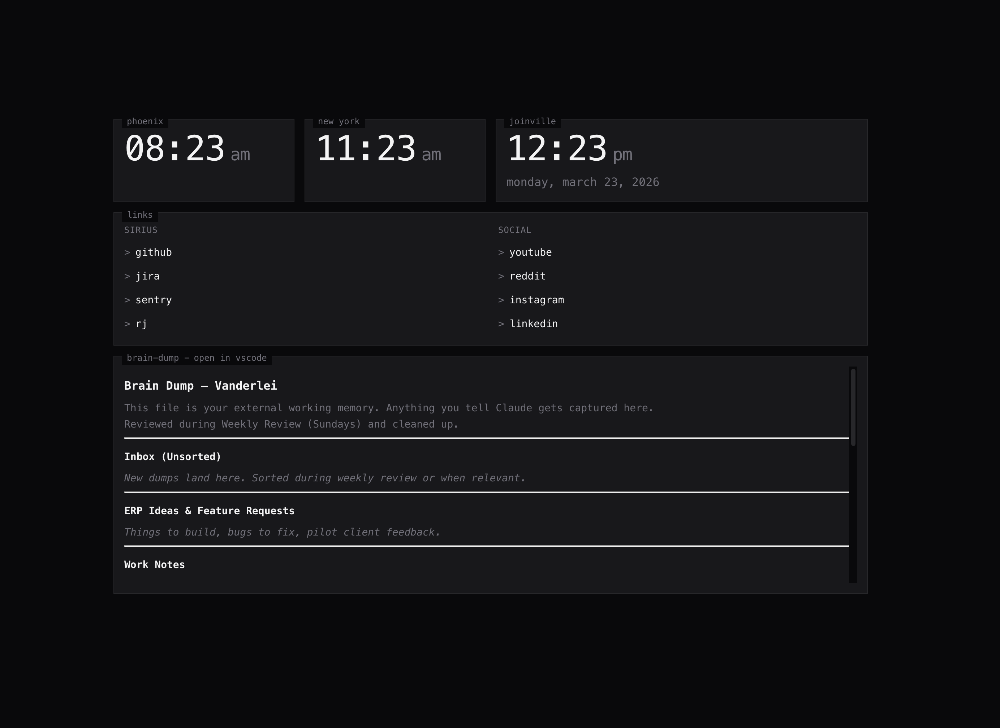

# homebase

A TUI-style browser startpage/dashboard built with [Deno Fresh](https://fresh.deno.dev/). Configure your dashboards with YAML files and enjoy real-time updates.



> ATTENTION: It's an experiment - feel free to fork it.

## Features

- **TUI Aesthetic**: Clean, terminal-inspired design with monospace fonts and subtle borders
- **YAML Configuration**: Define dashboards with simple YAML files
- **Multiple Dashboards**: Create separate dashboards for different contexts (work, personal, projects)
- **Real-time Updates**: File changes trigger instant UI updates via Server-Sent Events
- **Widget System**: Extensible architecture for adding new widget types
- **Themeable**: Customize colors using Tailwind color names
- **Self-contained Binary**: Compile to a single executable for easy deployment

## Quick Start

### Prerequisites

- [Deno](https://deno.land/) 2.0+ (or use the Nix flake)

### Development

```bash
# Clone the repository
git clone https://github.com/yourusername/homebase.git
cd homebase

# Using Nix (recommended)
direnv allow  # or: nix develop

# Start development server
deno task dev

# Open http://localhost:8000
```

### Configuration

Create your dashboard configuration:

```bash
# Create config directory
mkdir -p ~/.config/homebase/dashboards
mkdir -p ~/.config/homebase/notes

# Copy example dashboard
cp examples/default.yaml ~/.config/homebase/dashboards/
cp -r examples/notes/* ~/.config/homebase/notes/

# Edit your dashboard
$EDITOR ~/.config/homebase/dashboards/default.yaml
```

### Production

```bash
# Build for production
deno task build

# Compile to executable
deno task compile

# Run the binary
CONFIG_DIR=~/.config/homebase ./homebase
```

## Configuration Reference

### Dashboard Structure

```yaml
name: "My Dashboard"

# Layout
container_max_width: "1100px"  # "full", "80%", or pixel value
grid:
  columns: 4
  gap: "1rem"

# Typography
font_family: "JetBrains Mono"  # Local font
# OR
font_face:                      # Web font
  font_family: "Fira Code"
  src: "url(...)"

# Theme (use Tailwind color names)
dark_theme:
  bg: "zinc-950"
  bg_panel: "zinc-900"
  border: "zinc-800"
  text: "zinc-100"
  text_dimmed: "zinc-500"
  text_accent: "blue-400"
  success: "green-500"
  success_dimmed: "green-900"
  warning: "yellow-500"
  warning_dimmed: "yellow-900"
  danger: "red-500"
  danger_dimmed: "red-900"
  info: "blue-500"
  info_dimmed: "blue-900"

# Widgets
widgets:
  - type: "clock"
    label: "datetime"
    row: 1
    col: 1
    col_span: 2
    settings:
      timezone: "America/Sao_Paulo"
      format_24h: true
```

### Built-in Widgets

#### Clock

```yaml
- type: "clock"
  label: "datetime"
  row: 1
  col: 1
  settings:
    timezone: "UTC"           # IANA timezone
    format_24h: true          # 24-hour format
    show_seconds: true        # Show seconds
    show_date: true           # Show date below time
```

#### Bookmarks

```yaml
- type: "bookmarks"
  label: "links"
  row: 2
  col: 1
  col_span: 4
  settings:
    columns: 4                # Number of columns
    groups:
      - name: "work"
        links:
          - label: "GitHub"
            url: "https://github.com"
          - label: "Slack"
            url: "https://slack.com"
```

#### Markdown

```yaml
- type: "markdown"
  label: "notes"
  row: 2
  col: 1
  settings:
    file: "notes/todo.md"     # Relative to CONFIG_DIR
    max_height: "300px"       # Scrollable area
```

### Grid Positioning

Widgets are positioned using a CSS Grid system:

- `row`: Grid row (1-based)
- `col`: Grid column (1-based)
- `row_span`: Number of rows to span (optional)
- `col_span`: Number of columns to span (optional)

## Environment Variables

| Variable | Default | Description |
|----------|---------|-------------|
| `CONFIG_DIR` | `~/.config/homebase` | Dashboard configuration directory |
| `PORT` | `8000` | Server port |

## Directory Structure

```
~/.config/homebase/
├── dashboards/
│   ├── default.yaml
│   ├── work.yaml
│   └── personal.yaml
└── notes/
    ├── todo.md
    └── cheatsheet.md
```

## Roadmap

- [ ] Weather widget
- [ ] Slack notifications widget
- [ ] GitHub activity widget
- [ ] Google Calendar integration
- [ ] Interactive markdown editing
- [ ] API for external updates

## Development

```bash
# Run tests
deno task test

# Type check
deno task check

# Format code
deno fmt
```

## License

MIT

## Acknowledgments

- Design inspired by [re-start](https://github.com/refact0r/re-start)
- Built with [Deno Fresh](https://fresh.deno.dev/)
